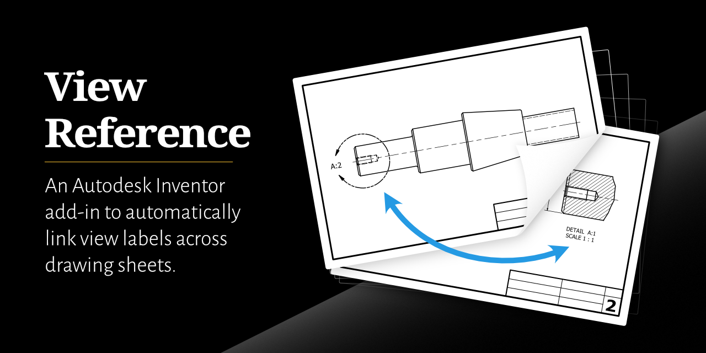

[](https://github.com/bretleasure/ViewReference/blob/27ee56f470b92748bee48287c9f5969306e723ef/img/open-graph-preview-img.png)

## Usage

The addin can either be used via the commmand buttons added to the Inventor UI or by using the API with your own code. 

## Installation

1. Download the ViewReferenceAddin-vX.X.X.zip file from the latest release
2. Unzip the contents into `C:\ProgramData\Autodesk\ApplicationPlugins`
3. First time starting Inventor the Addin may need to be unblocked.
   * Go to Tools Tab > Options Panel > Add-ins
     * Find the addin in the Available Add-Ins list and select it. Then Uncheck the *Block* checkbox and check *Load/Unloaded* and *Load Automatically*

**If using the Addin's API outside of iLogic:**

4. The ViewReference.dll needs to be added as a reference to your project
    * NuGet package available on [NuGet.org](https://www.nuget.org/packages/ViewReference) and [GitHub Packages](https://github.com/bretleasure/ViewReference/pkgs/nuget/ViewReference)

## Addin UI

The View Reference panel is added to the Place Views tab when a drawing document is open.

## Using the API

The `GetViewReferenceAddin()` extension method for `Inventor.Aplication` can be used to get the instance of `ViewReferenceAutomation`.

`ViewReferenceAutomation` includes the following methods that can be used:

| Method Name | Description |
| - | --- |
| CreateReferences(`ViewReferenceSettings`) | Adds references to all drawing views using the default settings |
| CreateReferences(`DrawingDocument`, `ViewReferenceSettings`) | Adds references to all drawing views using the provided settings |
| CreateReferences(`DrawingView`, `ViewReferenceSettings`) | Adds references to the one view with the provided settings |
| RemoveReferences(`DrawingDocument`) | Removes references from all drawing views |
| RemoveReferences(`DrawingView`) | Removes references from the one view |

### C#
```csharp
var dwgDoc = (DrawingDocument)inventorApp.Documents.Open(@"C:\Work\MyDrawing.idw");

var viewRefAddin = inventorApp.GetViewReferenceAddin();

viewRefAddin.CreateReferences(dwgDoc);
```

### iLogic
```vb
AddReference "ViewReference"
Imports ViewReference

Dim viewRefAddin As ViewReferenceAutomation
viewRefAddin = ThisApplication.GetViewReferenceAddin()

viewRefAddin.CreateReferences(ThisDoc.Document)
```

## Configuration

If using the addin in the Inventor UI, settings can be set by clicking the Configure button in the View Reference Ribbon Panel. If using the addin API, customizations are made by passing in `ViewReferenceSettings` into the `CreateReferences` methods.


> [!IMPORTANT]
> The API methods will not use the same settings that are set using the addin's configure window.


### `ViewReferenceSettings`

| Setting | Type | Description |
| - | --- | --- |
| CalloutStyle | string | Style string template for the view callouts |
| DetailViewLabelStyle | string | Style string template for detail view labels |
| SectionViewLabelStyle | string | Style string template for section view labels |
| ProjectedViewStyle | string | Style string template for projected view labels |
| AuxiliaryViewLabelStyle | string | Style string template for auxiliary view labels |
| AddReferencesToDetailViews | boolean | Whether references should be added to detail views |
| AddReferencesToSectionViews | boolean | Whether references should be added to section views |
| AddReferencesToProjectedViews | boolean | Whether references should be added to projected views |
| AddReferencestoAuxiliaryViews | boolean | Whether references should be added to auxiliary views |

## Styling

Attribute tags are used to create templates for how the callouts and labels will appear. The `AttributeTags` class contains all the possible tag strings.

| Tag | Description |
| - | --- |
| &lt;VIEW&GT; | View Name |
| &lt;VIEW SHEET #&gt; | Sheet number the view is located on |
| &lt;VIEW SHEET NAME&gt; | Sheet name the view is located on |
| &lt;PARENT SHEET #&gt; | Sheet number the parent view is located on (where the view callout is located) |
| &lt;PARENT SHEET NAME&gt; | Sheet name the parent view is located on (where the view callout is located) |
| &lt;DELIM&gt; | Delimeter (only available in view labels) |
| &lt;SCALE&gt; | View Scale (only available in view labels) |

### Examples

| Appears As | Template String | Template String Using `AttributeTags` Properties |
| - | --- | --- |
| B (2) | "&lt;VIEW&gt; (<VIEW SHEET #>)" | $"{AttributeTags.ViewName} ({AttributeTags.ViewSheetNumber})" 
| B (Sh. 2) | "&lt;VIEW&gt; (Sh. <VIEW SHEET #>)" | $"{AttributeTags.ViewName} (Sh. {AttributeTags.ViewSheetNumber})" |

## Privacy Policy

This application does not collect or store any personal data.
